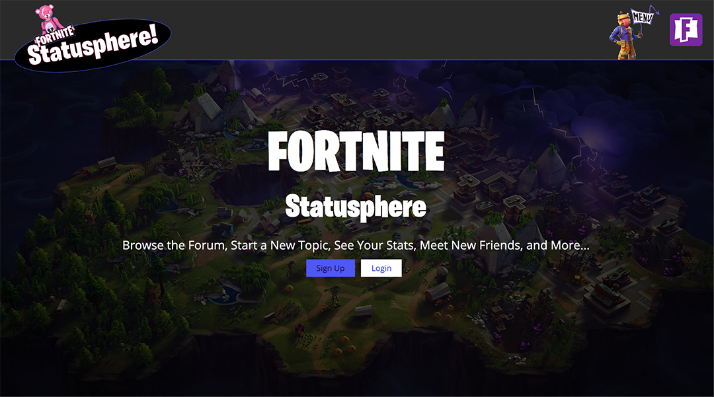
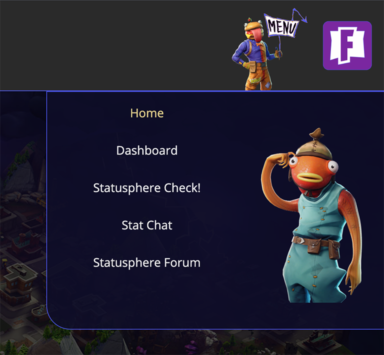
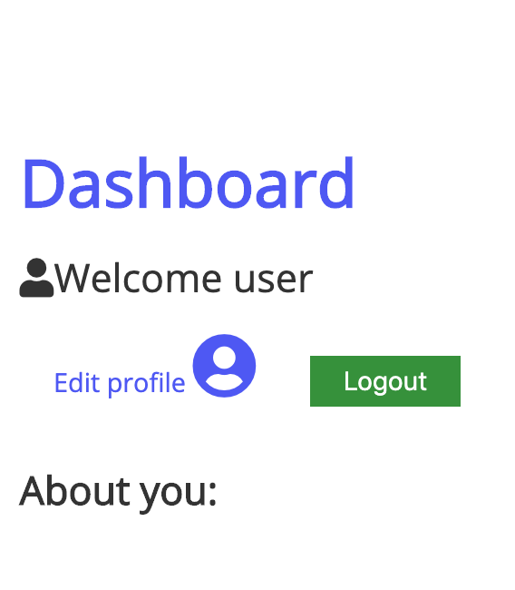
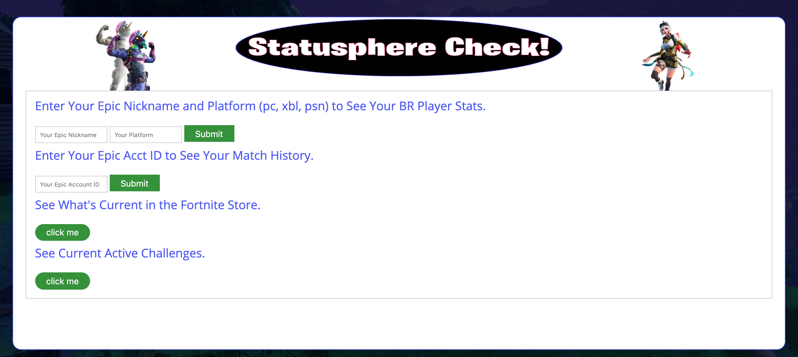

# Welcome to the Fortnite Statusphere

This will become the place to be for Fortnite fans. A fully functioning Forum, a Battle Royal/etc player stat checker, A chat room to meet new friends and put teams together, and more!

## Layout:

The landing page greets you with the option to register or sign in.

Or you can use the Menu to navigate throughout the site.

Dashboard:
Here you can make your unique profile. Upload a photo, write about yourself, and edit your user settings.

Statusphere Check:
The stat check uses a third party API to let the user see how they're doing in the Fortnite Battle Royal. They can also see their match history, what's current in the FN store, and see active challenges.

Stat Chat & Forum:
In a further build these pages will be incorporated into one page. Not only will users be able to use a classic forum to discuss their favorite game, but they will also be able to direct message each other.

## Technologies Used

- Live Sass Compiler (to create a minified css file)
- Node.js
- Express
- Javascript
- passport
- socket.io
- FortniteTracker API
